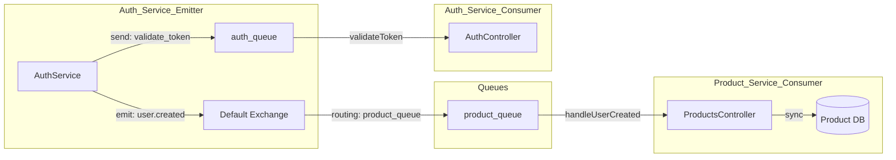

# RabbitMQ Messaging Patterns

This document details the advanced RabbitMQ implementation used for inter-service communication, highlighting the "expert" patterns for decoupling and data synchronization.

## Messaging Architecture
The system uses the **NestJS RabbitMQ Transport** to handle both asynchronous events and synchronous RPC calls.

## Expert Patterns Implemented

### 1. Dedicated Service Queues
Instead of sharing a single queue, each service has its own dedicated queue for the events it consumes:
-   **`auth_queue`**: Dedicated to the **Auth Service**. It primarily handles incoming Request-Response (RPC) calls like token validation.
*   **`product_queue`**: Dedicated to the **Product Service**. It listens for events like `user.created` to trigger local data synchronization.

**Expert Benefit**: This prevents "competing consumers" where one service might accidentally consume a message intended for another. It also ensures that if the Product Service is offline, its messages are buffered in its own queue without affecting the Auth Service.

### 2. Synchronous RPC (Request-Response)
The `AuthGuard` in the Product Service needs immediate confirmation of a user's identity. 
-   **Pattern**: `@MessagePattern({ cmd: 'validate_token' })`
-   **Operation**: The Product Service "sends" a message and waits for the Auth Service to "reply". This is a synchronous abstraction over RabbitMQ.

### 3. Asynchronous Events (Pub/Sub)
New user registrations are broadcast to the system.
-   **Pattern**: `@EventPattern('user.created')`
-   **Operation**: The Auth Service "emits" the event and continues its work immediately. This "fire-and-forget" approach ensures the registration process remains fast and responsive.

## Queue Configuration Details
| Queue Name | Purpose | Message Types |
| :--- | :--- | :--- |
| `auth_queue` | Target for Auth RPCs | `validate_token` |
| `product_queue` | Target for Product Events | `user.created` |
