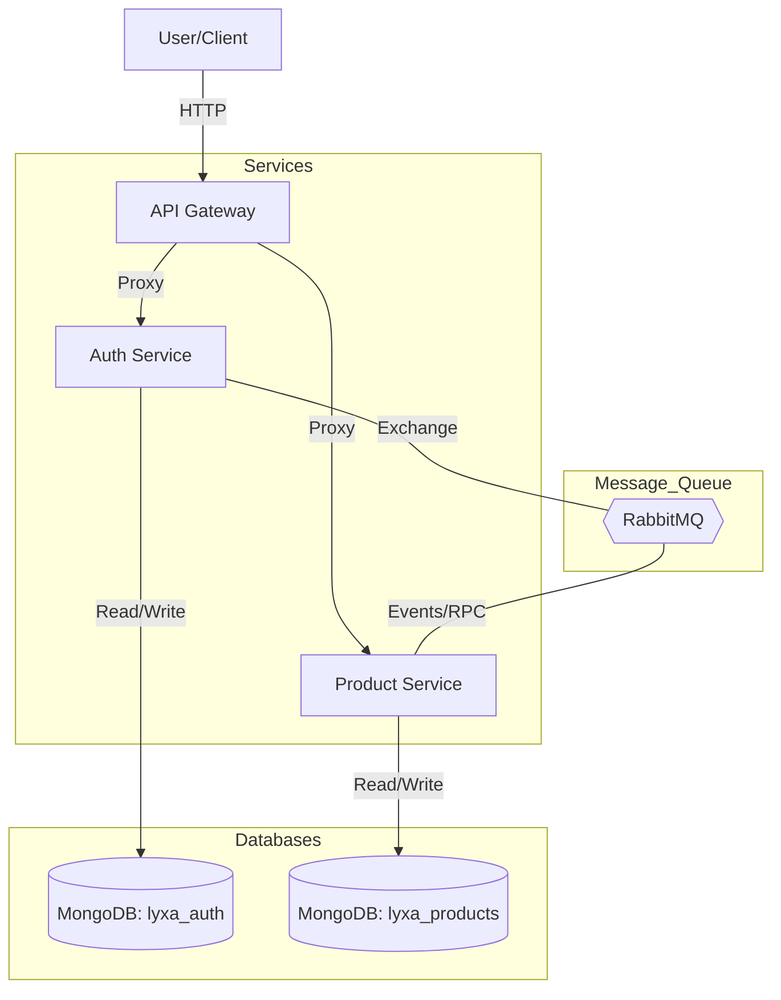

# System Architecture & Data Flow

This document provides a high-level overview of the Lyxa microservices architecture, detailing how the components interact and how data flows through the system.

## Overview
The project is built using a **Microservices Architecture** with three core components:

1.  **API Gateway**: The single entry point for all client requests. It handles routing and proxies requests to the appropriate downstream service.
2.  **Auth Service**: Manages user identity, registration, login, and JWT issuance.
3.  **Product Service**: Manages product CRUD operations and strictly enforces ownership-based authorization.

## System Diagram

## Data Flow Analysis

### 1. User Registration & Identity Flow
When a user registers:
1.  **Client** sends a POST request to `api-gateway/auth/register`.
2.  **API Gateway** proxies the request to the **Auth Service**.
3.  **Auth Service** hashes the password, saves the user to `lyxa_auth`, and emits a `user.created` event to RabbitMQ.
4.  **Product Service** (listening on `product_queue`) receives the event and synchronizes the user's basic info into its local `lyxa_products` database.

### 2. Authenticated Product Request Flow
When a user creates a product:
1.  **Client** sends a POST request to `api-gateway/products` with a Bearer Token.
2.  **API Gateway** proxies the request to the **Product Service**.
3.  **Product Service**'s `AuthGuard` triggers. It sends a synchronous RPC message `{ cmd: 'validate_token' }` via RabbitMQ to the **Auth Service**.
4.  **Auth Service** validates the JWT and returns the user payload.
5.  **Product Service** completes the operation and saves the product with the user's `ownerId`.

**Note**: The API Gateway uses `express-http-proxy` for efficient, transparent routing between the client and the microservices, ensuring a single consistent interface while maintaining a decoupled backend.
